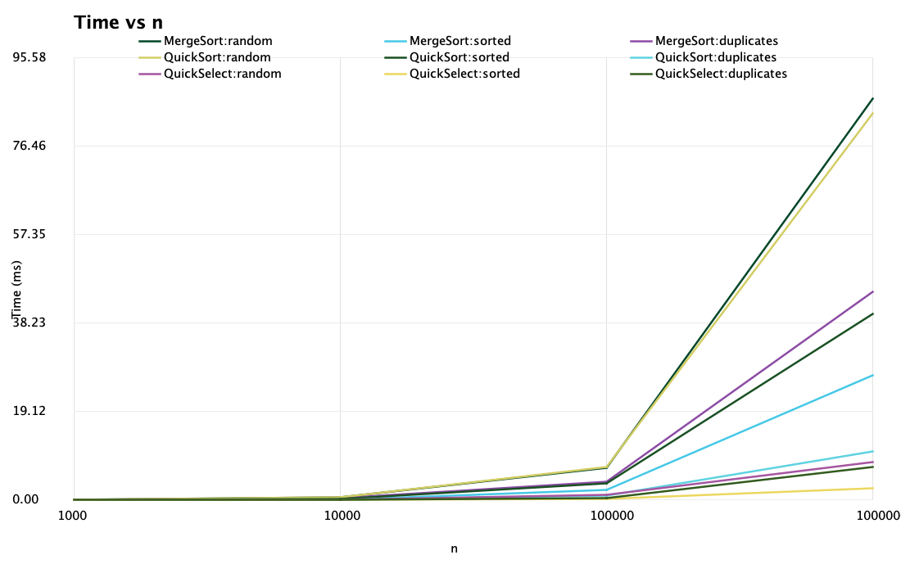
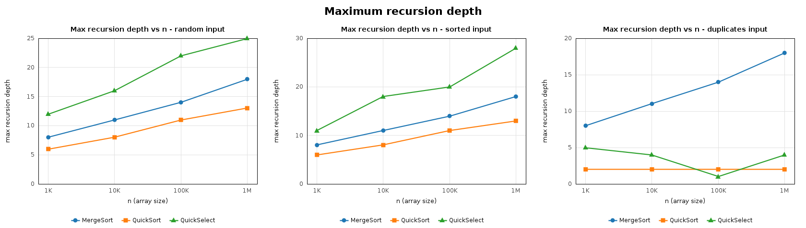
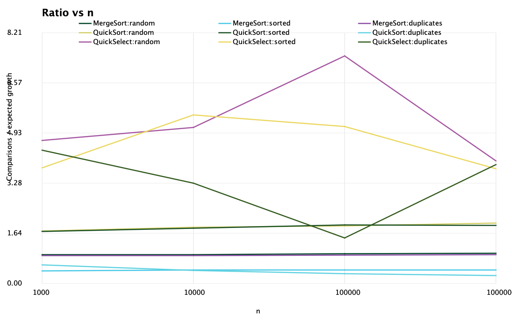

# Assignment 1 — Divide and Conquer & Asymptotic Notations

**Course:** Design and Analysis of Algorithms  
**Student:** Zhakanov Sanzhar, SE-2526
**Date:** 20 September 2026

## 1. Implemented algorithms

The project implements MergeSort, QuickSort and QuickSelect for `int[]` in Java.

- **MergeSort** allocates one helper array in the top-level call and passes it down the recursion (no `new int[...]` inside recursive calls). Subarrays of 15 elements or fewer are sorted with Insertion Sort. Merging two sorted halves takes O(n).
- **QuickSort** picks a random pivot and uses a 3-way partition (`< pivot`, `= pivot`, `> pivot`). It recurses only into the smaller part and processes the larger part in a `while` loop, so the recursion depth is at most about log₂ n even for sorted input.
- **QuickSelect** reuses the same partition method and continues only in the part that contains index `k`. An empty array or an out-of-range `k` throws `IllegalArgumentException`.
- **Metrics** counts comparisons, maximum recursion depth and time (`System.nanoTime()`); a `Metrics` object is passed into every algorithm, there are no global counters. For QuickSelect the "depth" is the number of partition rounds, i.e. the depth of the equivalent recursion.

**Counting convention.** One comparison is one `<`, `>` or `<=` test between two elements. In the 3-way partition an element that is not smaller than the pivot needs a second test (`>`), so the partition uses about 1.5 comparisons per element instead of 1. This raises the constants of QuickSort and QuickSelect but does not change their growth.

## 2. Asymptotic bounds

| Algorithm | Best case | Average case | Worst case |
|---|---|---|---|
| MergeSort | **Θ(n log n)** — any input, e.g. already sorted: there are still log n levels and every merge scans Θ(n) elements | **Θ(n log n)** — random input, ≈ n·log₂n comparisons | **Θ(n log n)** — any input, e.g. interleaved halves: merging is linear at every level |
| QuickSort (random pivot, 3-way) | **Θ(n)** — all elements equal: one partition puts everything into the "= pivot" block (with distinct keys the best case is Θ(n log n), perfectly balanced pivots) | **Θ(n log n)** — random input, and any fixed input because the pivot is random: expected ≈ 1.39·n·log₂n comparisons for distinct keys | **Θ(n²)** — every pivot is the minimum or maximum; probability 2ⁿ⁻¹/n!, so it practically never happens, and sorted input no longer causes it |
| QuickSelect | **Θ(n)** — the first pivot equals the k-th element, or all elements are equal: one partition | **Θ(n)** — random input: expected ≈ 3.4·n comparisons for the median | **Θ(n²)** — every pivot is an extreme element and k lies on the far side; probability negligible |
| Insertion Sort | **Θ(n)** — already sorted input: one comparison per element | **Θ(n²)** — random input: ≈ n²/4 inversions | **Θ(n²)** — reverse-sorted input: n(n−1)/2 comparisons and shifts |

## 3. Recurrences and the Master Theorem

Master Theorem for `T(n) = a·T(n/b) + f(n)`: compare `f(n)` with `n^(log_b a)`. Case 2: `f(n) = Θ(n^(log_b a))` ⇒ `T(n) = Θ(n^(log_b a) · log n)`. Case 3: `f(n) = Ω(n^(log_b a + ε))` plus the regularity condition ⇒ `T(n) = Θ(f(n))`.

### MergeSort

`T(n) = 2·T(n/2) + Θ(n)`

- a = 2, b = 2, f(n) = Θ(n), n^(log₂ 2) = n
- f(n) = Θ(n^(log_b a)) ⇒ **Case 2**
- **T(n) = Θ(n log n)**

### QuickSort (balanced split)

`T(n) = 2·T(n/2) + Θ(n)`

- a = 2, b = 2, f(n) = Θ(n) (the partition pass), n^(log₂ 2) = n
- **Case 2** ⇒ **T(n) = Θ(n log n)**

*Why a random pivot gives O(n log n) on average.* A random pivot falls into the middle half of the sorted order (ranks n/4 … 3n/4) with probability 1/2, and then both parts have at most 3n/4 elements. So on average every second partition step shrinks the subproblem by a constant factor, the recursion tree has O(log n) levels in expectation, and each level costs O(n). Equivalently, two elements with ranks i < j are compared only if one of them is chosen as pivot before any element between them (probability 2/(j−i+1)); summing over all pairs gives ≈ 2·n·ln n comparisons.

### QuickSelect (balanced split)

`T(n) = T(n/2) + Θ(n)`

- a = 1, b = 2, f(n) = Θ(n), n^(log₂ 1) = n⁰ = 1
- f(n) = Ω(n^(0+ε)) with ε = 1, and the regularity condition holds: a·f(n/b) = n/2 ≤ ½·f(n)
- This is **Case 3**, different from MergeSort and QuickSort (Case 2)
- **T(n) = Θ(n)**

The difference comes from recursing into only one half: the recursive part contributes only `n^(log_b a) = 1`, so the linear partition cost of the top level dominates.

## 4. Benchmark method

- Sizes: 1 000, 10 000, 100 000, 1 000 000. Inputs: `random` (random integers), `sorted` (already sorted), `duplicates` (random values 0..9). QuickSelect looks for the median (`k = n/2`).
- Every case is run 5 times on a fresh copy of the same array; the median of time, comparisons and depth is saved. A short warm-up phase is executed before the measurements.
- Output: `results.csv` with columns `algorithm,input,n,time_ms,comparisons,max_depth`.
- QuickSort and QuickSelect use an unseeded random pivot, so their comparison counts differ slightly between runs; MergeSort is deterministic. All numbers in this report are taken from the committed `results.csv`. Times were measured on the author's laptop (macOS, OpenJDK 26, compiled for Java 17) and depend on the machine.

## 5. Plots

*Time vs n (log-log). One panel per input type, one line per algorithm.*

*Maximum recursion depth vs n. QuickSort stays below log₂ n even on sorted input.*

*Ratio vs n. One panel per algorithm, one line per input type: comparisons / (n·log₂ n) for the sorts, comparisons / n for QuickSelect.*

## 6. Θ check

`f(n) = Θ(g(n))` means there are constants c₁, c₂ > 0 and n₀ with `c₁·g(n) ≤ f(n) ≤ c₂·g(n)` for all `n ≥ n₀`. Here f(n) is the measured number of comparisons; if `f(n)/g(n)` becomes almost constant, the guess for g(n) is supported. The constants below are read from the three largest sizes (n₀ = 10 000) and rounded outwards. With only three points this is empirical evidence, not a proof.

| Algorithm | Input | g(n) | ratio at n = 10⁴ / 10⁵ / 10⁶ | c₁ | c₂ | n₀ |
|---|---|---|---|---:|---:|---:|
| MergeSort | random | n log₂n | 0.955 / 0.988 / 0.998 | 0.95 | 1.00 | 10 000 |
| MergeSort | sorted | n log₂n | 0.446 / 0.448 / 0.455 | 0.44 | 0.46 | 10 000 |
| MergeSort | duplicates | n log₂n | 0.916 / 0.941 / 0.949 | 0.91 | 0.95 | 10 000 |
| QuickSort | random | n log₂n | 1.845 / 1.896 / 1.979 | 1.80 | 2.00 | 10 000 |
| QuickSort | sorted | n log₂n | 1.821 / 1.925 / 1.908 | 1.80 | 1.95 | 10 000 |
| QuickSort | duplicates | **n** | 5.78 / 5.51 / 5.40 | 5.3 | 5.8 | 10 000 |
| QuickSelect | random | n | 5.11 / 7.47 / 4.02 | 4.0 | 7.5 | 10 000 |
| QuickSelect | sorted | n | 5.53 / 5.15 / 3.76 | 3.7 | 5.6 | 10 000 |
| QuickSelect | duplicates | n | 3.29 / 1.50 / 3.90 | 1.4 | 4.0 | 10 000 |

- **MergeSort:** the ratio is almost constant on all three inputs ⇒ Θ(n log n). On sorted input it is ≈ 0.45, because merging two sorted runs stops after the left run is used up (n/2 comparisons per level).
- **QuickSort, random and sorted:** the ratio is almost constant (≈ 1.8–2.0) ⇒ Θ(n log n). It is close to the expected 3·ln 2 ≈ 2.1 (1.5 comparisons per element × 1.39).
- **QuickSort, duplicates:** the ratio to n·log₂n is **not** constant (it falls from 0.435 to 0.271), so `n log n` is the wrong g(n) for this input. The ratio to `n` is almost constant (5.4–5.8) ⇒ **Θ(n)**. With only 10 distinct values, every partition removes the whole "= pivot" block, so a few passes over the data are enough.
- **QuickSelect:** comparisons / n shows no upward trend with n, but it is noisy (4–7.5) because the pivots are random and each point is one median-of-5 sample; therefore c₁ and c₂ are far apart. This supports Θ(n).

## 7. Discussion

The comparison counts match the theory: MergeSort stays at ≈ 1.0·n·log₂n (0.45 on sorted input), QuickSort at ≈ 1.8–2.0·n·log₂n on random and sorted input, and QuickSelect at ≈ 4–7.5·n on random and sorted input, which is the expected ≈ 3.4·n multiplied by our ≈ 1.5 comparisons per element. The random pivot removes the sorted-input problem: at n = 10⁶ QuickSort needs 40 ms on sorted input and 84 ms on random input, and the recursion depth is 13 (below log₂ n ≈ 19.9) because only the smaller side is recursed into. MergeSort's depth is 18 ≈ log₂(n/15) + 2, because the cutoff of 15 replaces the lowest levels by Insertion Sort; this changes the constant, not the growth. The 3-way partition makes duplicate-heavy input the cheapest case for QuickSort (Θ(n), depth 2, 10.6 ms at n = 10⁶), and QuickSelect is about 10 times faster than QuickSort on random input (8.3 ms vs 84 ms) as Θ(n) versus Θ(n log n) predicts. The time per n·log₂n is almost equal for both sorts for n ≥ 10⁴ (≈ 4.2–4.5 ns), so the running time follows n log n as well. The differences at small n (at n = 1 000 QuickSort needs 5.3 ns and MergeSort 2.6 ns per n·log₂n) are consistent with JVM warm-up and fixed overheads, since these runs take only 0.03–0.05 ms. MergeSort becomes slower per element as n grows (2.6 → 4.4 ns), which is consistent with CPU cache effects, because the array plus the buffer no longer fit into the fast caches. Both sorts are also faster on sorted input than on random input (MergeSort 27 ms vs 87 ms at n = 10⁶): MergeSort needs fewer comparisons there (0.45 instead of 1.0·n·log₂n), and for both sorts the branches are easier for the CPU to predict; garbage collection can add extra noise to individual runs. Comparison counts and depth are therefore more reliable than wall-clock time for checking the theory.

## 8. Testing

JUnit 5 tests (`AlgorithmTest`) cover:

1. MergeSort and QuickSort against `Arrays.sort` on 100 random arrays each.
2. Edge cases for **both** sorts: empty array, one element, all elements equal, already sorted array (MergeSort also: reverse-sorted array and sizes around the cutoff 15).
3. QuickSort depth on a sorted array of 100 000 elements: `maxDepth <= 2·log₂(n)`; QuickSort on a sorted array of 1 000 000 elements does not overflow the stack.
4. QuickSort on an array of 200 000 equal elements needs at most 3n comparisons (no O(n²) on duplicates).
5. QuickSelect against `sorted[k]` on 100 random arrays (with and without duplicates), for the overloads `select(a, k)` and `select(a, k, metrics)`.
6. Invalid QuickSelect input: empty array, `k < 0`, `k >= n`.

Run with `mvn clean test`.

## 9. Conclusion

All required components are implemented and tested, the measured comparison counts agree with the Θ bounds, and the plots and `results.csv` are reproducible with the commands in `README.md`. The one place where the naive guess `Θ(n log n)` fails is QuickSort on duplicate-heavy input, where the 3-way partition makes it Θ(n).
